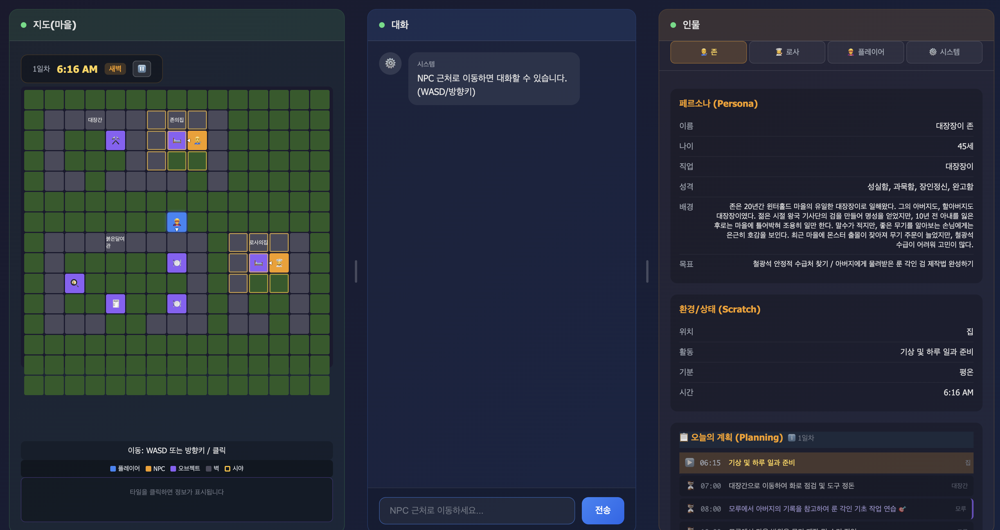
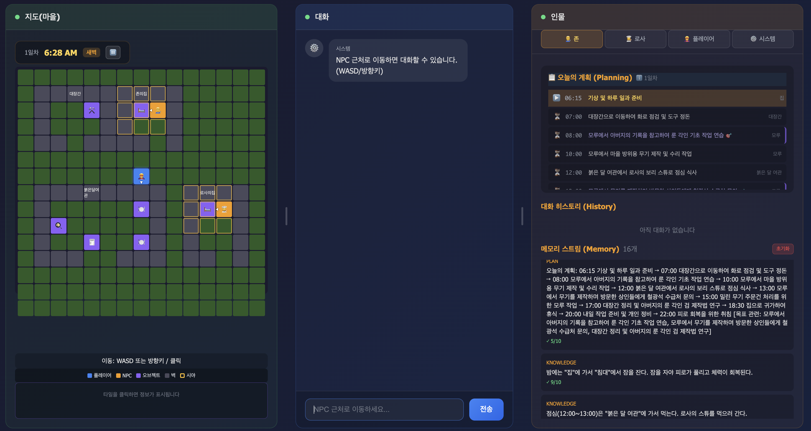
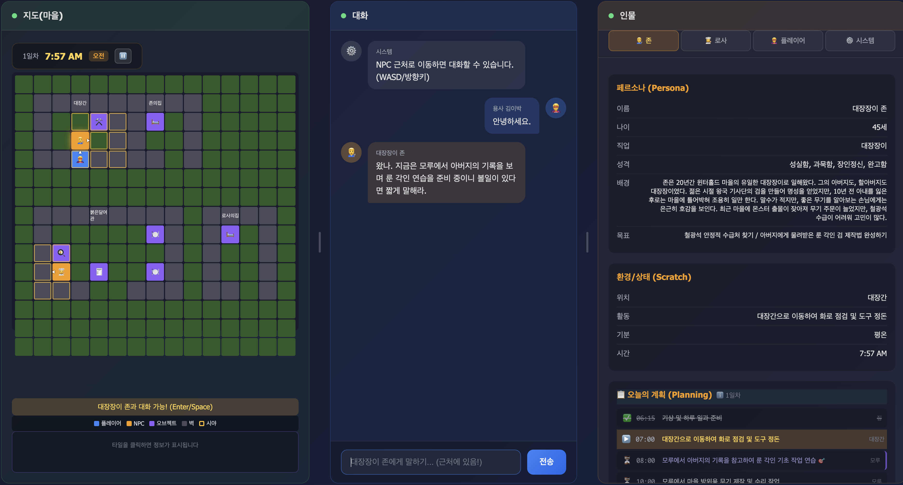

# AI NPC Agent - Generative Agents 기반 대화 시스템

Stanford [Generative Agents (2023)](https://arxiv.org/abs/2304.03442) 논문을 기반으로 구현한 **자율적 NPC 대화 및 행동 생성 엔진**입니다.

---

## 스크린샷





---

## 핵심 기능

| 개발요건 | 구현 내용 | 핵심 코드 |
|----------|----------|----------|
| **페르소나/환경/대화히스토리/기억 통합 발화 엔진** | Persona + Scratch + Memory Stream + Retrieval → LLM 프롬프트 조합 | `agent.ts:buildPrompt()` |
| **장단기 기억 저장 및 색인/추출 알고리즘** | Recency × Importance × Relevance 스코어링 | `memory.ts:retrieve()` |
| **심리/감정/의도 추론 기반 자율 발화** | Emotion System + Thought Memory + shouldContinueConversation() | `agent.ts:1230-1341` |
| **NPC 자율 의사결정** | Planning (하루계획) + Reaction (반응 판단) + Replanning (재조정) | `agent.ts`, `npc-controller.ts` |
| **RAG 기반 지능형 에이전트** | Memory Retrieval → Context Injection → LLM Generation | `memory.ts`, `agent.ts` |
| **Prompt Engineering** | 기능별 프롬프트 설계 (대화/계획/반성/자율발화) | `agent.ts` 내 각 메서드 |

---

## 시스템 아키텍처

### 논문 기반 설계

```
┌───────────────────────────────────────────────────────────────────────────┐
│                      Generative Agents Architecture                       │
├───────────────────────────────────────────────────────────────────────────┤
│                                                                           │
│   ┌──────────────┐                                                        │
│   │   PERCEIVE   │  ← 환경 인지 (시야 내 엔티티/오브젝트)                 │
│   └──────┬───────┘                                                        │
│          ▼                                                                │
│   ┌──────────────┐     ┌──────────────┐     ┌──────────────┐              │
│   │   RETRIEVE   │────▶│    PLAN      │────▶│    REACT     │              │
│   │  (기억 검색) │     │  (계획 수립) │     │  (반응 결정) │              │
│   └──────────────┘     └──────────────┘     └──────────────┘              │
│          │                    │                    │                      │
│          ▼                    ▼                    ▼                      │
│   ┌───────────────────────────────────────────────────────────┐           │
│   │                      MEMORY STREAM                        │           │
│   │  ┌────────────┬────────────┬────────────┬────────────┐    │           │
│   │  │ observation│ reflection │   thought  │    plan    │    │           │
│   │  │ (관찰/대화)│   (성찰)   │ (내면판단) │   (계획)   │    │           │
│   │  └────────────┴────────────┴────────────┴────────────┘    │           │
│   └───────────────────────────────────────────────────────────┘           │
│          │                                                                │
│          ▼                                                                │
│   ┌──────────────┐                                                        │
│   │   REFLECT    │  ← 10회 대화마다 고수준 인사이트 생성                  │
│   └──────────────┘                                                        │
│                                                                           │
└───────────────────────────────────────────────────────────────────────────┘
```

### 구현 아키텍처

```
┌───────────────────────────────────────────────────────────────────────────┐
│                         Browser (Client-Only)                             │
├───────────────────────────────────────────────────────────────────────────┤
│                                                                           │
│  ┌─────────────┐    ┌─────────────┐    ┌──────────────────────────────┐   │
│  │ index.html  │───▶│   app.ts    │───▶│          GameWorld           │   │
│  │  (UI+CSS)   │    │ (Controller)│    │   (타일맵+엔티티+시야)       │   │
│  └─────────────┘    └─────────────┘    └──────────────┬───────────────┘   │
│                                                       │                   │
│                          ┌────────────────────────────┼────────┐          │
│                          ▼                            ▼        ▼          │
│                   ┌─────────────┐              ┌─────────────────┐        │
│                   │NpcController│─────────────▶│    NPCAgent     │        │
│                   │ (계획→이동) │              │  (대화/감정)    │        │
│                   └─────────────┘              └────────┬────────┘        │
│                          │                              │                 │
│        ┌─────────────────┼──────────────────────────────┤                 │
│        ▼                 ▼                              ▼                 │
│  ┌───────────┐    ┌───────────┐                 ┌─────────────┐           │
│  │ GameTime  │    │  Persona  │                 │ MemoryStore │           │
│  │(게임 시간)│    │  (정적)   │                 │(localStorage)│          │
│  └───────────┘    ├───────────┤                 └──────┬──────┘           │
│                   │  Scratch  │◀──── 감정변화 ─────────┘                  │
│                   │  (동적)   │                                           │
│                   └───────────┘                                           │
│                          │                                                │
│                          ▼                                                │
│                   ┌─────────────┐                                         │
│                   │GeminiClient │◀─────── API Key (User Input)            │
│                   │  (LLM API)  │                                         │
│                   └──────┬──────┘                                         │
└──────────────────────────┼────────────────────────────────────────────────┘
                           ▼
                    ┌─────────────┐
                    │ Gemini API  │
                    │(Google Cloud)│
                    └─────────────┘
```

---

## 핵심 알고리즘

### 1. Memory Retrieval (RAG)

**목적**: 현재 상황에 관련된 기억을 검색하여 LLM 컨텍스트로 주입

```
score = recency + importance + relevance

┌───────────────────────────────────────────────────────────────┐
│ Recency (최신성)                                              │
│   score = 0.995^(hours_since_last_access)                     │
│   → 최근 접근 기억일수록 높은 점수                            │
├───────────────────────────────────────────────────────────────┤
│ Importance (중요도)                                           │
│   score = importance / 10  (1-10 정규화)                      │
│   → LLM이 평가한 중요도 (Reflection 시 재평가)                │
├───────────────────────────────────────────────────────────────┤
│ Relevance (관련성)                                            │
│   score = matchCount / queryWords.length                      │
│   → 키워드 매칭 비율 (향후 임베딩 기반으로 개선 가능)         │
└───────────────────────────────────────────────────────────────┘
```

**구현 위치**: `memory.ts:88-132`

### 2. Planning System

**목적**: NPC가 하루 계획을 세우고 시간에 따라 행동 변경

```
┌─────────────┐     ┌─────────────┐     ┌─────────────┐
│    06:15    │     │  시간 경과  │     │    22:00    │
│  wakeUp()   │────▶│  활동 변경  │────▶│   sleep()   │
│  계획 생성  │     │  moveTo()   │     │  계획 초기화│
└─────────────┘     └─────────────┘     └─────────────┘
       │                   │
       ▼                   ▼
┌───────────────────────────────────────────────────────┐
│ generateDailyPlan() 입력:                             │
│   - Persona (성격, 직업, 목표)                        │
│   - Knowledge (가능한 장소/활동)                      │
│   - 어제 했던 일 (dailyPlan 검색)                     │
│   - Reflection (최근 인사이트)                        │
├───────────────────────────────────────────────────────┤
│ 출력: DailyPlanItem[]                                 │
│   { time, activity, location, duration, status }      │
└───────────────────────────────────────────────────────┘
```

**구현 위치**: `agent.ts:627-814`, `npc-controller.ts:192-287`

### 3. Autonomous Speech (자율 발화)

**목적**: NPC가 플레이어를 인식하고 먼저 대화 시작

```
플레이어 이동 → perceive() → 시야에 플레이어?
                                      │
                                      ▼ YES
                        shouldInitiateConversation()
                        ┌───────────────────────────┐
                        │ 규칙 기반 필터:           │
                        │ - 자는 중? → NO           │
                        │ - 화난 상태? → NO         │
                        │ - 쿨다운 중? → NO         │
                        └─────────────┬─────────────┘
                                      │
                                      ▼ PASS
                        ┌───────────────────────────┐
                        │ LLM 판단:                 │
                        │ - 성격 고려               │
                        │ - 현재 활동 고려          │
                        │ - 관련 기억 검색          │
                        │ → YES/NO 응답             │
                        └─────────────┬─────────────┘
                                      │
                                      ▼ YES
                        generateSpontaneousUtterance()
                        → "어서 오게, 뭐 필요한 거라도?"
```

**구현 위치**: `agent.ts:1025-1111`, `npc-controller.ts:580-636`

### 4. Conversation Continuation Decision (대화 지속 판단)

**목적**: NPC가 성격과 일정에 따라 대화를 계속할지 판단

```
대화 응답 후 → checkShouldContinue()
                      │
                      ▼
          ┌───────────────────────────────┐
          │ 입력:                         │
          │ - 다음 일정 (nextPlan)        │
          │ - 일정까지 남은 시간          │
          │ - 대화 턴 수                  │
          │ - NPC 성격                    │
          └───────────────┬───────────────┘
                          │
                          ▼
          ┌───────────────────────────────┐
          │ LLM 판단:                     │
          │ - 성실한 NPC → 일정 중시      │
          │ - 사교적 NPC → 대화 중시      │
          │ - 급한 대화 → 일정 미룸       │
          └───────────────┬───────────────┘
                          │
          ┌───────────────┴───────────────┐
          │                               │
          ▼ continue: true                ▼ continue: false
     대화 계속                 ┌───────────────────────┐
                              │ 1. thought 저장       │
                              │ 2. 작별 인사 출력     │
                              │ 3. endConversation()  │
                              │ 4. 재플래닝           │
                              └───────────────────────┘
```

**구현 위치**: `agent.ts:1230-1341`, `app.ts:640-663`

### 5. Reflection System

**목적**: 축적된 기억에서 고수준 인사이트 생성

```
대화 10회 도달 → triggerReflection()
                         │
                         ▼
          ┌───────────────────────────────┐
          │ 1. 최근 기억 중요도 재평가    │
          │    (LLM으로 1-10 점수)        │
          └───────────────┬───────────────┘
                          │
                          ▼
          ┌───────────────────────────────┐
          │ 2. 고중요도 기억 선별         │
          │    (importance >= 7)          │
          └───────────────┬───────────────┘
                          │
                          ▼
          ┌───────────────────────────────┐
          │ 3. 인사이트 생성 (LLM)        │
          │    "손님들은 주로 검을 찾는다"│
          └───────────────┬───────────────┘
                          │
                          ▼
          ┌───────────────────────────────┐
          │ 4. reflection 타입으로 저장   │
          │    importance: 8 (고정)       │
          └───────────────────────────────┘
```

**구현 위치**: `agent.ts:475-580`

---

## 데이터 구조

### NPC 정의

```typescript
// src/client/npcs/blacksmith_john.ts
interface NpcDefinition {
  persona: Persona;      // 정적 정체성
  scratch: Scratch;      // 동적 상태
  knowledge: string[];   // 세계 지식
  locations: Map;        // 장소→좌표 매핑
  worldSetup: WorldSetup; // 월드 배치
}
```

| 컴포넌트 | 역할 | 예시 |
|---------|------|------|
| **Persona** | 불변 정체성 | 이름, 성격, 배경, 말투 |
| **Scratch** | 가변 상태 | 위치, 활동, 기분, 시간 |
| **Knowledge** | 세계 지식 | "대장간에 모루가 있다" |
| **Locations** | 이동 좌표 | "대장간 내부" → (5, 3) |

### Memory 구조

```typescript
interface Memory {
  id: string;           // "m001"
  type: MemoryType;     // 'observation' | 'reflection' | 'thought' | 'plan' | 'knowledge'
  content: string;      // "손님이 검을 구매했다"
  timestamp: string;    // ISO 8601
  importance: number;   // 1-10
  lastAccess: string;   // Recency 계산용
  sources?: string[];   // Reflection 소스 ID
}
```

| 타입 | 생성 시점 | 중요도 | 용도 |
|------|----------|--------|------|
| `observation` | 대화/인식 | 5→재평가 | 대화 기록, 관찰 |
| `reflection` | 10회 대화 | 8 (고정) | 고수준 인사이트 |
| `thought` | 내적 판단 | 3-5 | 혼잣말, 판단 기록 |
| `plan` | 기상 시 | 6 | 하루 계획 |
| `knowledge` | 초기화 | 7 | 세계 지식 |

---

## 프롬프트 엔지니어링

### 대화 프롬프트 구조

```
┌───────────────────────────────────────────────────┐
│ ## 당신의 정체 (Persona)                          │
│ 이름, 나이, 직업, 성격, 배경, 목표, 말투          │
├───────────────────────────────────────────────────┤
│ ## 현재 상태 (Scratch)                            │
│ 위치, 활동, 기분, 시간                            │
│ + 현재 계획 컨텍스트 (하는 일, 다음 일정)         │
├───────────────────────────────────────────────────┤
│ ## 관련 기억 (Retrieved Memories)                 │
│ - "어제 손님이 검을 샀다" (중요도: 7)             │
│ - "철광석이 부족하다" (중요도: 6)                 │
├───────────────────────────────────────────────────┤
│ ## 최근 대화 (Conversation History)               │
│ 최근 6개 턴                                       │
├───────────────────────────────────────────────────┤
│ ## 사용자 발화                                    │
│ "검 하나 살 수 있을까요?"                         │
├───────────────────────────────────────────────────┤
│ ## 응답 지침                                      │
│ - 1-3문장, 말투 준수                              │
│ - 현재 활동 반영                                  │
│ - 반복 금지                                       │
│ - JSON 형식: {response, mood, intent}             │
└───────────────────────────────────────────────────┘
```

### JSON 출력 형식

```json
{
  "response": "좋은 검이 있지. 이 장검은 어떤가?",
  "mood": "happy",
  "intent": "sell",
  "playerObservation": "검에 관심이 많은 손님이다"
}
```

---

## 파일 구조

```
src/
├── client/
│   ├── agent.ts              # NPCAgent (핵심)
│   │   ├── chat()            # 대화 + 감정 파싱 + 메모리 저장
│   │   ├── buildPrompt()     # 프롬프트 조합 (RAG)
│   │   ├── triggerReflection() # 10회마다 성찰
│   │   ├── generateDailyPlan() # 하루 계획 생성
│   │   ├── shouldInitiateConversation() # 자율 발화 판단
│   │   └── checkShouldContinue() # 대화 지속 판단
│   │
│   ├── memory.ts             # MemoryStore
│   │   ├── add()             # 메모리 추가
│   │   ├── retrieve()        # RAG 검색 (Recency×Importance×Relevance)
│   │   └── getRecentImportanceSum() # Reflection 트리거 체크
│   │
│   ├── game/
│   │   ├── npc-controller.ts # NpcController
│   │   │   ├── startConversation() # 대화 시작 (이동 정지)
│   │   │   ├── endConversation()   # 대화 종료 (재플래닝)
│   │   │   └── moveTo()      # 장소 이동
│   │   ├── world.ts          # GameWorld (타일맵, 시야)
│   │   └── time.ts           # GameTime (게임 내 시간)
│   │
│   └── npcs/
│       ├── blacksmith_john.ts # 대장장이 존 (Persona + Scratch + Knowledge)
│       ├── innkeeper_rosa.ts  # 여관주인 로사
│       └── types.ts           # NpcDefinition 타입
│
└── web/
    └── app.ts                 # UI 컨트롤러 + 게임 루프
```

---

## 실행 방법

```bash
npm install
npm run dev      # http://localhost:3000
npm run build    # 프로덕션 빌드
```

브라우저 접속 → API 키 입력 → NPC와 대화

---

## 시연 포인트

| 기능 | 시연 방법 | 확인 항목 |
|------|----------|----------|
| **RAG 검색** | 이전 대화 언급 | 관련 기억이 응답에 반영 |
| **감정 시스템** | 화나게 하는 대화 | mood 변화 + 메모리 저장 |
| **Planning** | 시간 경과 | 06:15 기상 → 활동 변경 → 22:00 취침 |
| **자율 발화** | 플레이어 이동 | NPC 시야 진입 시 먼저 인사 |
| **Reflection** | 10회 대화 | 시스템 로그에 "성찰 생성 중..." |
| **대화 지속 판단** | 일정 직전 대화 | "슬슬 가봐야겠어" + 이동 |
| **NPC-NPC 대화** | 두 NPC 시야 교차 | 자동 대화 3턴 진행 |

---

## Implementation Details (논문 외 구현)

논문에서 다루지 않는 **실제 구현 시 필요한 엣지 케이스 처리**입니다.

### 1. 자는 NPC 자동 기상

**상황**: 플레이어가 자는 NPC(`isAwake: false`)에게 말을 건다

**문제**: 대화는 진행되지만 `dailyPlan`이 없어서 대화 종료 후 NPC가 멈춤

**해결**:
```
startConversation() 호출 시:
  if (!isAwake) → wakeUp() → 하루 계획 생성 → 대화 진행
```

**구현**: `npc-controller.ts:195-201`

### 2. 대화 중 일정 시간 초과 감지

**상황**: 대화하다가 다음 일정 시간을 넘겨버림 (현재 11:15, 다음 일정 11:00)

**문제**: `minutesUntilNext = -15`인데 자정 넘김(23:00→01:00)과 구분 필요

**해결**:
```
if (minutesUntilNext < 0 && minutesUntilNext > -12*60):
  → 실제 일정 초과! 즉시 대화 종료
  → thought: "이런, 11:00에 점심 준비해야 하는데 이미 지났다!"
  → 발화: "앗, 이런! 벌써 이 시간이네. 점심 준비 해야 해서 먼저 가볼게!"

if (minutesUntilNext < 0 && minutesUntilNext <= -12*60):
  → 자정 넘김 (23:00 → 01:00)
  → minutesUntilNext += 24*60
```

**구현**: `agent.ts:1312-1326`

### 3. 대화 종료 후 재플래닝 (진짜 Replanning)

**상황**: 긴 대화로 상황이 바뀜 (예: "오늘 도적이 나타났대요" 정보 획득)

**해결**:
```
endConversation() 시:
  if (대화 시간 >= 30분):
    → replan(currentTime) 호출  ← LLM으로 새 계획 생성!
    → 최근 중요 정보 (importance >= 6) 반영
    → 현재 시간부터 22:00까지 새 계획
    → 기존 완료 계획 + 새 계획 병합
```

**기존 계획 vs 재플래닝**:
```
기존: 10:00 점심준비 → 12:00 손님맞이 → 14:00 청소
           ↓ 대화에서 "오늘 식재료 배달 온다" 정보
재플래닝: 12:00 식재료 수령 → 13:00 재고 정리 → 14:00 손님맞이
```

**구현**: `agent.ts:869-990`, `npc-controller.ts:242-260`

### 4. Thought 메모리 타입

**목적**: NPC의 내면 판단/혼잣말을 기록 (플레이어에게 보이지 않음)

**논문과 차이**: 논문에는 observation/reflection/plan만 있음

**사용 시점**:
- 대화 지속 판단 시: "바빠서 대화를 그만해야겠다"
- 자율 발화 판단 시: "저 손님에게 말을 걸어볼까?"
- 일정 초과 감지 시: "이런, 시간이 지났다!"

**구현**: `agent.ts:addThought()`

### 5. 플레이어 발화 쿨다운

**목적**: 자율 발화 스팸 방지 (같은 플레이어에게 반복 말 걸기 방지)

**설정**: 3초 쿨다운

**구현**: `npc-controller.ts:605-610`

### 6. NPC-NPC 대화 쿨다운

**목적**: 같은 NPC끼리 반복 대화 방지

**설정**: 5분 쿨다운 (양방향 공유 키: "john↔rosa")

**구현**: `npc-controller.ts:641-645`

---

## Known Limitations

| 영역 | 현재 구현 | 논문/권장 |
|------|----------|----------|
| **Relevance** | 키워드 매칭 | 임베딩 코사인 유사도 |
| **Reflection 트리거** | 10회 대화 (고정) | 중요도 합계 > 150 |
| **저장소** | localStorage (5MB) | 서버 DB |
| **Fine-tuning** | 미적용 | 도메인 특화 학습 |

---

## 기술 스택

- **Language**: TypeScript
- **Build**: Vite
- **AI**: Google Gemini API (`gemini-2.0-flash`)
- **Storage**: localStorage (브라우저)

---

## References

- [Generative Agents: Interactive Simulacra of Human Behavior (Stanford, 2023)](https://arxiv.org/abs/2304.03442)
- [Google Gemini API Documentation](https://ai.google.dev/docs)

---

## License

MIT
